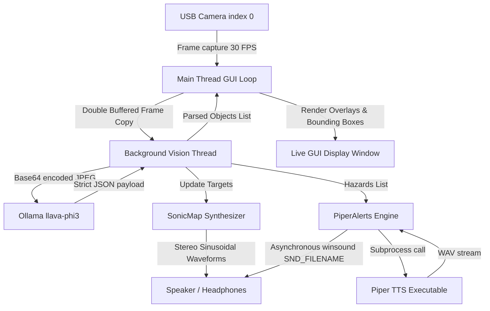
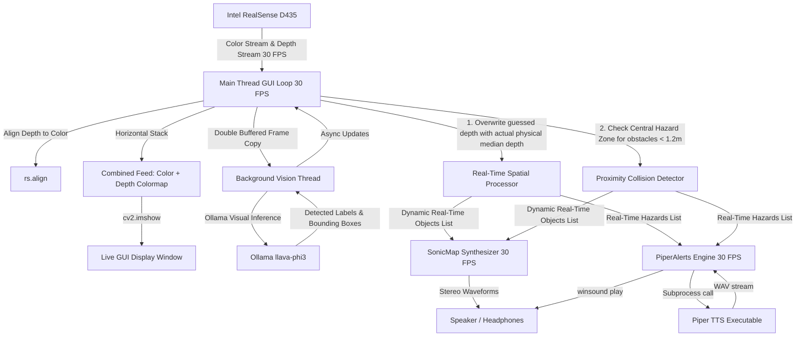

# Echo-Gnosis: Local Audio-Tactile Semiotics & Spatial Accessibility Assistant

**Echo-Gnosis** is a local, real-time spatial accessibility assistant. It translates the physical environment in front of a user into a continuous spatial stereo audio map and speaks verbal safety warnings of immediate hazards (like stairs or obstacles) using local neural text-to-speech.

The application operates **100% offline** with zero cloud API dependencies. It is structured into two versions depending on the hardware available:
*   **Version 1**: Standard 2D Webcam mode using multimodal local AI.
*   **Version 2**: Intel RealSense D435 Depth Camera mode adding side-by-side color/depth preview, real-time physical telemetry updates, and 30 FPS proximity collision detection.

---

# Version 1: Standard Webcam Spatial Assistant

In **Version 1**, the application uses a standard 2D webcam. Visual understanding and distance estimation are driven entirely by a local visual language model running in a background thread.

### System Architecture & Flow (Version 1)



### Core Features (Version 1)
*   **Webcam Stream**: Captures input frames from any standard USB webcam.
*   **AI Spatial Analysis**: Feeds frames to a local `llava-phi3` vision model. The model detects objects, coordinates, relative sizes, and estimates depth (from `0.1` near to `1.0` far).
*   **Continuous Sonification**: Modulates active stereo voices representing target elements (horizontal position maps to stereo panning, vertical position to pitch, and estimated depth to volume).
*   **Spoken TTS Warnings**: Piper TTS announces immediate hazards (e.g., *"stairs ahead."*) with a default **5-second cooldown timer** to avoid sound spam.

---

# Version 2: Intel RealSense D435 Depth Camera Integration

**Version 2** is the full hardware-accelerated implementation of Echo-Gnosis. By integrating an **Intel RealSense D435** depth camera, the assistant merges deep semantic understanding with precise real-time physical telemetry.

### System Architecture & Flow (Version 2)



### Core Features (Version 2)
*   **Coherent Dual Stream Preview**: Captures color and depth frames concurrently, aligning the depth stream to the color coordinate frame. The live window shows the color webcam feed side-by-side with a colorized depth colormap (rendered via `COLORMAP_JET`).
*   **30 FPS Spatial Synthesis**: Decouples audio synthesizer updates from the background visual language model thread. Object locations are mapped in real time to the aligned depth map, calculating actual median physical distances (in meters) and updating panning/frequency/volume instantly.
*   **Proximity Hazard & Collision Avoidance**: Monitors a central safety zone (covering the middle 30% width and bottom 55% height of the sensor's field of view). If any physical obstacle enters this zone closer than **1.2 meters**, the app immediately:
    1.  Triggers a flashing red warning box on the GUI display.
    2.  Announces a verbal alert (*"obstacle ahead"*).
    3.  Modulates the continuous audio synthesizer to indicate danger.
*   **Smart Fallback Mode**: If the `pyrealsense2` library is missing or the hardware pipeline fails to initialize (e.g., the camera is disconnected), the app automatically falls back to **Version 1** standard webcam mode, showing a disabled/mock depth map status message.

---

## 3. How the Spatial Audio Synthesizer Works

Unlike verbal warnings which can be slow and overwhelming, the continuous spatial sound map provides **tactile, intuitive coordinates** of your physical environment.

When objects are detected, their positions are translated into relative coordinates `position_x` and `position_y` (ranging from `-1.0` to `1.0`). The system then assigns each detected object to one of 4 dynamic voice channels in [audio_synthesizer.py](file:///d:/Github/Echo-Gnosis/audio_synthesizer.py). Each channel synthesizes a continuous sine wave modulated by these coordinates:

*   **Stereo Panning (Horizontal)**: `position_x` (ranging from `-1.0` far left to `1.0` far right). Uses constant-power stereo panning so the sound glides smoothly across channels as the object moves.
*   **Pitch/Frequency (Vertical)**: `position_y` (ranging from `-1.0` bottom of frame to `1.0` top of frame). Maps to a frequency band between **200 Hz** (deep bass hum for low-lying items) and **800 Hz** (higher-pitched alert tones for elevated items).
*   **Volume (Distance & Depth)**: Maps depth/distance to voice amplitude.
    *   *Webcam Mode*: Relies on Ollama's estimated visual depth scale `[0.1 (loud, near), 1.0 (quiet, far)]`.
    *   *RealSense Mode*: Measures actual physical distance. Distances are mapped to sound volume, scaling from `0.3 meters` (near, maximum volume) to `4.0 meters` (far, minimum volume).

---

## 4. Technical Stack & Local Components

Echo-Gnosis relies on the following local components:

### Software & Local Models
*   **Ollama Desktop**: Runs the Vision-LLM locally on localhost port `11434`.
    *   *Model Used*: `llava-phi3` (multimodal visual-text parser).
*   **Piper TTS**: A fast, local neural text-to-speech system.
    *   *Engine*: Pre-compiled `piper.exe` binary.
    *   *Voice Model*: `en_US-lessac-medium.onnx` (a natural-sounding US English voice).
*   **Python Libraries**:
    *   `pyrealsense2`: Controls the Intel RealSense SDK pipeline (used in Version 2).
    *   `opencv-python` (CV2): Handles webcam capture, frame processing, and GUI rendering.
    *   `sounddevice` (PortAudio): Connects to the host audio output and manages real-time callback synthesis.
    *   `numpy`: Used for high-speed mathematical sound wave rendering.
    *   `ollama`: Client library for the Ollama desktop API.

### Hardware Requirements
*   **Audio**: Stereo headphones or speakers (essential to perceive left/right panning).
*   **Processor**: A modern CPU or GPU capable of running Ollama and local model inference at under 1.5s per frame.
*   **Camera**:
    *   *Version 1*: Standard USB webcam.
    *   *Version 2*: Intel RealSense D435 depth camera.

---

## 5. Installation and Execution

### Step 1: Clone the Repository
```bash
git clone https://github.com/yourusername/echo-gnosis.git
cd echo-gnosis
```

### Step 2: Install and Start Ollama
1. Download Ollama from [ollama.com](https://ollama.com).
2. Install and launch Ollama Desktop.
3. Open your terminal and pull the model:
   ```bash
   ollama pull llava-phi3
   ```

### Step 3: Set Up Piper TTS
1. Download the pre-built Piper binaries for your OS from the [Piper GitHub Releases Page](https://github.com/rhasspy/piper/releases).
2. Extract the archive and place the contents inside a folder named `piper` in the root of this project repository.
3. Download a voice model (such as `en_US-lessac-medium.onnx` and `en_US-lessac-medium.onnx.json`) from the [Piper Voices Repository](https://github.com/rhasspy/piper/blob/master/VOICES.md).
4. Save these voice files inside your `piper/` directory.

### Step 4: Install Python Dependencies
Create a virtual environment and install dependencies:
```bash
python -m venv venv
# On Windows:
venv\Scripts\activate
# On Linux/macOS:
source venv/bin/activate

pip install -r requirements.txt
```

### Step 5: Start the Application
Connect your camera and execute:
```bash
python main.py
```

---

## 6. Keyboard Shortcuts & UI Reference

*   **Visual Bounding Boxes**:
    *   **Green Boxes**: Standard detected objects with descriptions (e.g. `chair`, `desk`) and telemetry in meters.
    *   **Red Boxes**: Immediate physical hazards (e.g., stairs, walls, or vehicles).
*   **Warning Banner**: A bold red header reading `WARNING: [OBJECT] AHEAD!` flashes on the top of the GUI feed when a hazard is active.
*   **Hazard Monitor Zone (RealSense Only)**: Shows a central dashed rectangle in the color feed. Flashes bright red and plays beeps/speech warnings when an obstacle enters the range (`< 1.2m`).
*   **Keyboard Shortcuts**:
    *   Focus on the video feed window and press **`q`** or **`ESC`** to safely terminate the program, halt threads, and release the camera capture device.
