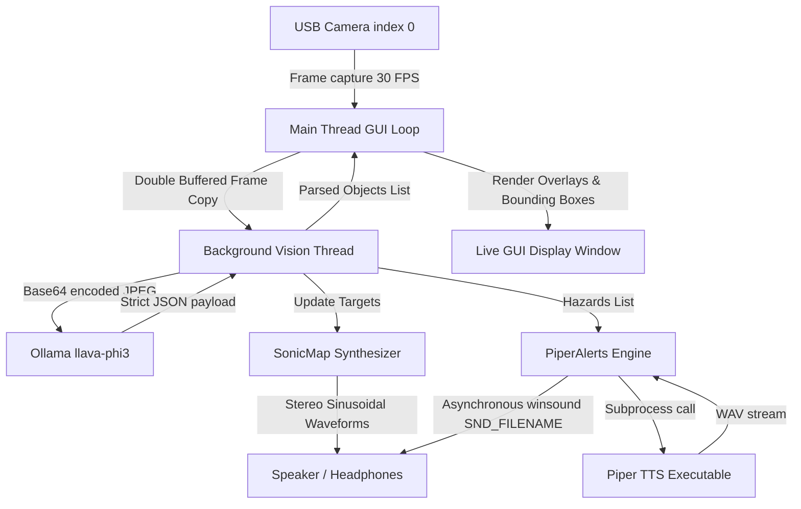

# Echo-Gnosis: Local Audio-Tactile Semiotics & Spatial Accessibility Assistant

**Echo-Gnosis** is a local, real-time spatial accessibility assistant. It captures video frames from a USB camera, processes them offline using a local Vision-LLM, translates the visual coordinates into a continuous spatial stereo audio map, and alerts you verbally of immediate physical hazards (like stairs or obstacles) using local text-to-speech.

The application operates **100% offline** with zero cloud API dependencies, providing low-latency spatial awareness, a live webcam window overlay with object boxes, and spoken safety alerts.

---

## 1. System Architecture & Flow



---

## 2. Technical Stack & Hardware/Software Components

Echo-Gnosis relies on the following local components:

### Software & Local Models
* **Ollama Desktop**: Runs the Vision-LLM locally on localhost port `11434`.
  * **Model Used**: `llava-phi3` (Llava-Phi-3-Mini, a 3.8B parameter multimodal model optimized for low-latency visual-text parsing).
* **Piper TTS**: A fast, local neural text-to-speech system.
  * **Engine**: Pre-compiled `piper.exe` binary.
  * **Voice Model**: `en_US-lessac-medium.onnx` (a natural-sounding US English female voice) and its corresponding config JSON.
* **Python libraries**:
  * `opencv-python` (CV2): Handles webcam capture, frame resizing, GUI window creation, and 2D overlay drawings.
  * `sounddevice` (PortAudio): Connects to the host OS audio output and manages the low-level, non-blocking real-time audio thread callback.
  * `numpy`: Used for high-speed mathematical sound wave synthesis.
  * `ollama` (Python SDK): Communicates with the local Ollama desktop API client.

### Hardware Requirements
* **Webcam**: Standard USB camera (index `0` or `1`).
* **Audio**: Stereo headphones or speakers (essential to perceive left/right panning).
* **Processor**: A modern CPU or GPU capable of running Ollama and local model inference at under 1.5s per frame.

---

## 3. How the Spatial Audio Synthesizer Works

Unlike verbal warnings which can be slow and overwhelming, the continuous spatial sound map provides **tactile, intuitive coordinates** of your physical environment.

When Ollama detects objects (e.g., `"person"`, `"desk"`, `"chair"`), it outputs their positions in standard image coordinates `x` (horizontal) and `y` (vertical) ranging from `0.0` (top-left) to `1.0` (bottom-right). The system automatically maps these values inside [vision_processor.py](file:///c:/Users/GEU/Desktop/EG/echo-gnosis/vision_processor.py) into relative coordinates `position_x` and `position_y` (ranging from `-1.0` to `1.0`) for audio processing.

The system then assigns each detected object to one of 4 dynamic voice channels in [audio_synthesizer.py](file:///c:/Users/GEU/Desktop/EG/echo-gnosis/audio_synthesizer.py). Each channel synthesizes a continuous sine wave modulated by the object's relative coordinates:

### Panning (Horizontal Position)
* **Variable**: `position_x` (ranging from `-1.0` far left, `0.0` center, to `1.0` far right, calculated as `(x * 2.0) - 1.0`).
* **Effect**: Uses constant-power stereo panning. If an object is to your left, the tone plays predominantly in your left headphone. As it moves right, the sound glides smoothly across the center to the right channel.

### Pitch / Frequency (Vertical Position)
* **Variable**: `position_y` (ranging from `-1.0` bottom of frame, to `1.0` top of frame, calculated as `1.0 - (y * 2.0)`).
* **Effect**: Maps linearly to a frequency band between **200 Hz** (deep, low-frequency hum) and **800 Hz** (higher-pitched alert tone). 
  * As an object is elevated or placed higher in the frame, **its pitch increases**.
  * Low-lying items generate a low, grounding bass frequency.

### Volume (Distance & Depth)
* **Variable**: `depth` (ranging from `0.1` very close, to `1.0` far away).
* **Effect**: Dictates the amplitude of the voice channel. 
  * If an object is right in front of the lens (`depth = 0.1`), the tone is **loud**.
  * If the object is far away (`depth = 1.0`), the tone is **very quiet / faint**.

### Fading & Silence
* **Fade Out**: When an object moves out of view, its target amplitude is set to `0.0`. The sound wave fades out over approximately 45 milliseconds to avoid clicking or popping artifacts.
* **Silence**: If no objects are visible or detected, all synthesis channels fade out, resulting in complete silence.

---

## 4. How to Set Up and Run (GitHub User Guide)

Follow these steps to download, install, and run Echo-Gnosis on your local machine:

### Step 1: Clone the Repository
```bash
git clone https://github.com/yourusername/echo-gnosis.git
cd echo-gnosis
```

### Step 2: Install and Start Ollama
1. Download Ollama for Windows, macOS, or Linux from [ollama.com](https://ollama.com).
2. Install and launch Ollama Desktop.
3. Open your terminal and pull the multimodal model:
   ```bash
   ollama pull llava-phi3
   ```
4. Verify Ollama is running in the background (by default, it hosts an API on `http://localhost:11434`).

### Step 3: Set Up Piper TTS
The system expects the Piper TTS engine to be located locally inside the project folder:
1. Download the pre-built Piper binaries for your OS from the [Piper GitHub Releases Page](https://github.com/rhasspy/piper/releases).
2. Extract the archive and place the contents inside a folder named `piper` in the root of this project repository.
3. Download a voice model ONNX and configuration file (such as `en_US-lessac-medium.onnx` and `en_US-lessac-medium.onnx.json`) from the [Piper Voices Repository](https://github.com/rhasspy/piper/blob/master/VOICES.md).
4. Save these voice files inside your `piper/` directory.

Your directory layout should look like this:
```text
echo-gnosis/
  ├── piper/
  │    ├── piper.exe (or binary for linux/macOS)
  │    ├── en_US-lessac-medium.onnx
  │    └── en_US-lessac-medium.onnx.json
  ├── main.py
  ├── vision_processor.py
  ├── ...
```

### Step 4: Install Python Dependencies
Create a virtual environment (recommended) and install the packages:
```bash
# Create environment
python -m venv venv

# Activate on Windows:
venv\Scripts\activate
# Activate on Linux/macOS:
source venv/bin/activate

# Install dependencies
pip install -r requirements.txt
```

### Step 5: Start the Application
Connect your USB camera and execute:
```bash
python main.py
```

---

## 5. Using the Application & Keyboard Shortcuts

* **Webcam GUI Feed**: A window titled **"Echo-Gnosis Live GUI"** will pop up on your screen. You will see what the camera sees at a smooth **30 FPS**.
* **Visual Bounding Boxes**:
  * **Green Boxes** indicate standard detected objects. Bounding boxes are automatically labeled with the object description (e.g. `chair`, `desk`) and estimated depth.
  * **Red Boxes** outline physical obstacles flagged as immediate dangers (such as stairs, walls directly ahead, or moving vehicles).
* **Warning Banner**: A bold red header reading `WARNING: [OBJECT] AHEAD!` flashes on the top of the GUI feed when a hazard is active.
* **Spoken Alerts**: The voice alerts (e.g. *"stairs ahead."*) play through your speakers. If the hazard stays in the frame, it will not spam you continuously because of a built-in **5-second cooldown timer**.
* **Audio Navigation**: Put on stereo headphones and move an object (like a cup or phone) horizontally, vertically, or forward/backward to experience panning, pitch variations, and volume updates.
* **Keyboard Shortcuts**:
  * Focus on the video feed window and press **`q`** or **`ESC`** to safely terminate the program, halt threads, and release the camera capture device.
